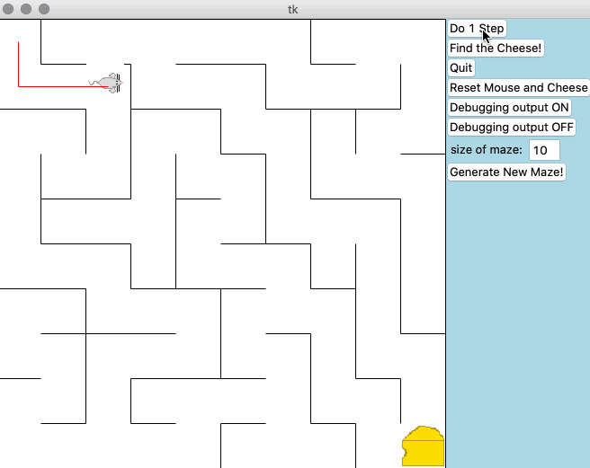

# MouseInAMaze

Game mouse in a maze is a simple Python game where:

* [x] User can **move the mouse step by step through the maze to the cheese**
* [x] User can **move the mouse in 1 click through the maze to the cheese**
* [x] User can **generate new maze with any size on his/her choices**

## Video Walkthrough

Here's a walkthrough of implemented user stories:

GIF created with [LiceCap](http://www.cockos.com/licecap/).
